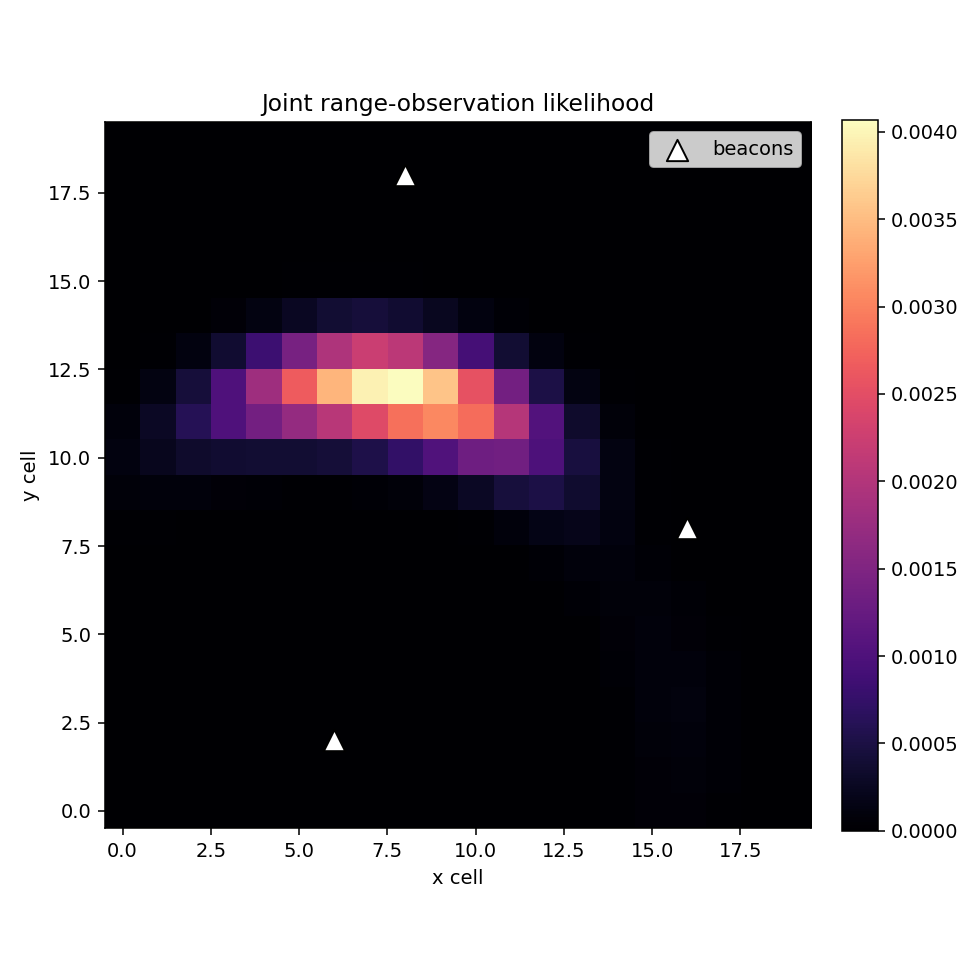

# Landmark Observation Model

Range-only landmark observation likelihoods over a 2D grid map. The implementation computes single-beacon likelihood maps and joint likelihoods for multiple beacons with independent Gaussian measurement noise.

## Run

```bash
python - <<'PY'
import numpy as np
from ex4 import joint_observation_likelihood

grid = np.zeros((20, 20))
beacons = np.array([[6, 2], [8, 18], [16, 8]])
z = np.array([10, 5, 9])
sigma = np.array([1, 5, 3])

likelihood = joint_observation_likelihood(z, sigma, beacons, grid)
print(likelihood.shape, likelihood.max())
PY
```

## Result screenshots



Joint range-observation likelihood heatmap over a 2D grid.


## What this demonstrates

- Range-only landmark likelihood computation over candidate robot positions.
- Combination of independent beacon observations into a joint likelihood map.
- A small probabilistic perception module that can feed localization methods.


## Limitations and next steps

- The model assumes independent Gaussian range errors.
- It does not include data association or bearing measurements.
- Next steps: add multi-modal examples and integrate with a localization filter.

